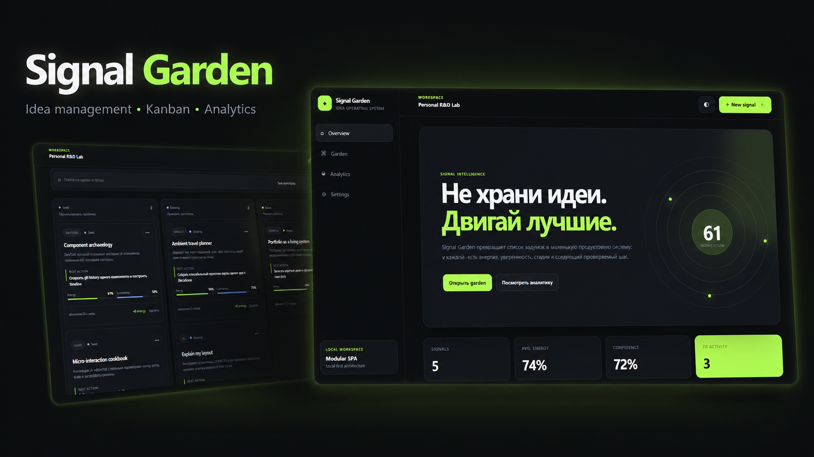

# Signal Garden



Signal Garden - это local-first приложение для хранения, развития и приоритизации идей.

Идеи проходят простой жизненный цикл - **Seed → Growing → Bloom**, а показатели энергии, уверенности, следующие действия и история активности помогают понять, какие идеи стоит развивать дальше.

## Возможности

* Kanban-доска с drag & drop
* Создание, редактирование, перемещение и удаление идей
* Оценка идеи по уровню энергии и уверенности
* Следующие действия, категории и теги
* Главная страница со сводной информацией и историей активности
* Аналитика и расчёт показателя momentum
* Поиск и фильтрация
* Светлая и тёмная темы
* Импорт и экспорт данных в JSON
* Сохранение состояния в LocalStorage
* Адаптивный интерфейс
* SPA-навигация через History API
* Unit-тесты на `node:test`
* Собственные скрипты разработки и сборки без внешних зависимостей

## Локальный запуск

Требуется Node.js 18+.

```bash
npm run dev
```

После запуска приложение будет доступно по адресу:

```text
http://localhost:5173
```

## Тесты

```bash
npm test
```

## Production-сборка

```bash
npm run build
npm run preview
```

Preview-версия будет доступна по адресу:

```text
http://localhost:4173
```

## Структура проекта

```text
signal-garden/
├── index.html
├── package.json
├── scripts/
├── src/
│   ├── data/
│   ├── lib/
│   ├── store/
│   ├── views/
│   ├── main.js
│   └── styles.css
└── tests/
```

## Архитектура

Состояние приложения управляется через отдельный store. Логика сохранения данных, аналитика, представления и UI-компоненты разделены по независимым модулям.

Бизнес-логика вынесена из слоя отображения, благодаря чему структура проекта остаётся более понятной и удобной для дальнейшего развития.
